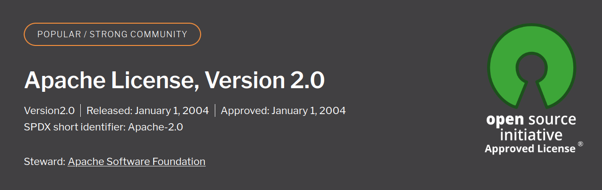

> Relaunch as Open Source in 2023.

# Mo Cuishle (2.0) OSS

The [first attempt](2016-09-26-mocuishle.md) was a *Mozilla Add-on* containing a *JAR*. It was able to switch the proxy settings, import the certificate authority, start and stop the *Java* process, ... , but all this is gone with [Firefox ESR 52](https://blog.mozilla.org/addons/2018/08/21/timeline-for-disabling-legacy-firefox-add-ons/), the last version supporting this feature set.

I've leaved *Mo Cuishle* at *GitHub* for years. I've lost my *PGP* key to publish things in *Maven Central*. But, I've used *Mo Cuishle* on a daily base all the time. I've finally realized it's a bad idea to hold the sources in private. I'm sorry. Now I've removed some incomplete fragments, renamed some classes and packages, and pushed it up to *GitHub* finally.

The architecture of the relaunch is an *Executable JAR* and browser extensions for *Mozilla Firefox* and *Google Chrome*. These webextensions are restricted so it's not as simple as before, but the major features are working again. It's a little more difficulty at install time: The application must be installed and the trusted certificate have to be imported in the browser manually. After that, it works like before.

The Android app is not included any more. Mobile platforms like Android aren't good supported by *Nonblocking IO* the base technology of *Netty*, formerly the IO framework of *JBoss Application Server*. It works very well on *Linux* but can be surprising on other platforms, on every different phone.

## IDEAs

I've no plans to continue the current dependencies of *Mo Cuishle*, but some ideas:

* [X] ~~**LittleProxy-http* is replaced with *[okhttp-tls](https://square.github.io/okhttp/4.x/okhttp-tls/okhttp3.tls/)* which is a clear and complete API to handle *TLS* certificates very easy.*~~ [2023-10-06] see: [Replace Netty with OkHttp (#10)](https://github.com/ganskef/MoCuishle/pull/10)
* [X] ~~**LittleProxy* based on *Netty* is replaced with an *[okhttp](https://square.github.io/okhttp)* or *[JDK](https://docs.oracle.com/javase/8/docs/jre/api/net/httpserver/spec/com/sun/net/httpserver/HttpServer.html)* based proxy server.*~~ [2023-10-06] see: [Replace Netty with OkHttp (#10)](https://github.com/ganskef/MoCuishle/pull/10)
* [ ] A [Self-Contained Application](https://docs.oracle.com/javase/8/docs/technotes/guides/deploy/self-contained-packaging.html) or [GraalVM Native Image](https://www.graalvm.org/latest/reference-manual/native-image/) or [Kotlin Native](https://kotlinlang.org/docs/native-overview.html) will be created.

See **[Mo Cuishle (1.0)](2016-09-26-mocuishle.md)** for features and the vision behind.

See **https://github.com/ganskef/MoCuishle** to build and install.

