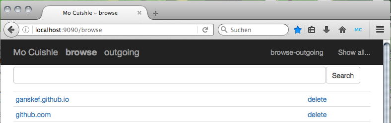

> Download and get it working on Java platforms.

# Mozilla Install

*Mo Cuishle* binary preview XPI is signed by 
[addons.mozilla.org](https://addons.mozilla.org/) (AMO) since version 20160331 
and above. It's available here only. <a class="button info" 
href="{{ site.url }}/mocuishle-binary-preview/mocuishle-1.0-20160926.xpi">Download</a> 7MB
<!--more-->

**The Software is distributed on an "AS IS" basis, WITHOUT WARRANTY OF ANY KIND, 
either express or implied.**

**Security Note: The encryption of the browser is broken. All content is stored 
UNENCRYPTED on your device.**

Please open an [issue](https://github.com/ganskef/MoCuishle/issues) containing 
information about your environment in case you've no success.

# Java

First of all you need *Java* installed on your system. 

# Mozilla Add-on

The *Add-on XPI* depends on a *Mozilla* browser. With it you can install it via 
the *Download* button from this site. *That's simple!*

# Start Up

*Mo Cuishle* is enabled on start up and launches the *Java* proxy in background. 
The browser opens a tab with the [Browse History]({{ site.url }}/browse-history/). 

Clicking the little blue *MC Toolbar Icon* stops/starts the *Java* process and 
removed/entered the following required settings in *Mozilla Firefox*:

 * Manual proxy configuration localhost:9090 for HTTP and HTTPS.

 * Disable browser cache to avoid conflicting with *Mo Cuishle* caching.

 * Disable automatic online/offline management for *Mo Cuishle*.

The *Mozilla Add-on* includes the *Mo Cuishle* logging in the *Browser Console*. 
Try <kbd>ctrl</kbd>+<kbd>shift</kbd>+<kbd>J</kbd>.

Enabling/Disabling the installation imports/removes the *Certificate Authority* 
needed to cache *HTTPS* contents. Try it in case of problems with certificates.

# Other Browsers, Settings

*Mo Cuishle* is a proxy application following *HTTP* standards. So it can be used 
without the add-on or with other browsers like *Google Chrome* too. The *XPI* is 
a *Zip* archive, containing an *Executable JAR*[^1]. Extract it and enter the 
command:

 java -jar mocuishle.jar

Logging is written to the console.

You have to find equivalents for following *Mozilla Firefox* preferences 
configured with `about:config`:

Manual proxy configuration localhost:9090 for HTTP and HTTPS:

 * prefs.set(&quot;network.proxy.http&quot;, &quot;localhost&quot;);
 * prefs.set(&quot;network.proxy.http_port&quot;, 9090);
 * prefs.set(&quot;network.proxy.ssl&quot;, &quot;localhost&quot;);
 * prefs.set(&quot;network.proxy.ssl_port&quot;, 9090);
 * prefs.set(&quot;network.proxy.type&quot;, 1);

Disable browser cache to avoid conflicting with *Mo Cuishle* caching:

 * <strike>prefs.set("browser.cache.disk.smart_size.enabled", false)</strike>
 * <strike>prefs.set(&quot;browser.cache.disk.capacity&quot;, 0);</strike>
   This breaks the refresh in mobile/tethering mode (tested with 39), replaced 
   by `devtools.cache.disabled` (found in 45).
 * prefs.set(&quot;devtools.cache.disabled&quot;, true);

Disable automatic online/offline management for *Mo Cuishle*:

 * prefs.set(&quot;network.manage-offline-status&quot;, false);
 * prefs.set(&quot;network.online&quot;, true);

[^1]: Before the first signed version `mocuishle-1.0-20160331.xpi` the *XPI* is 
      an *Executable Jar* at once. 