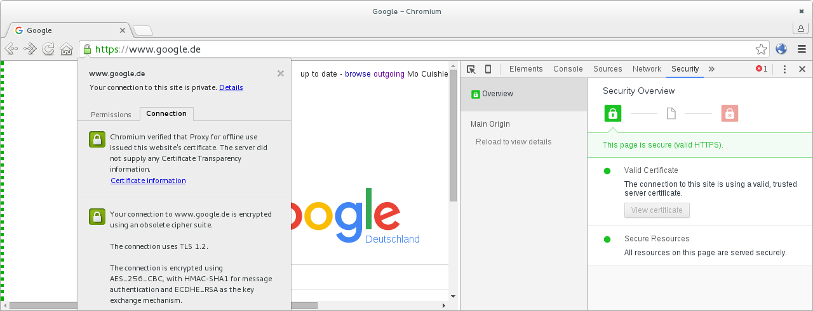

> Make Google Chrome and Android mediaserver happy.

# Chrome and Mediaserver

New binary previews are uploaded with some useful enhancements.
<!--more-->

## Google Chrome

Since Mo Cuishle uses 
[LittleProxy-mitm](https://github.com/ganskef/LittleProxy-mitm) it benefits from 
the last improvement with certificate generation. It was working before, but 
browsers have begun to distrust certificates signed with SHA1 message digest. 
For more details see this 
[commit](https://github.com/ganskef/LittleProxy-mitm/commit/64e2d9d2ed6ee2491a31124495639765d0586327).

## Android mediaserver

On Android devices mediaserver works hard while scanning the file based cache of 
*Mo Cuishle*. Sadly this is useless since there are no media files included. 
With my cache of 20GB containing 106 files it's running for hours 
and eats 4GB storage of the phone. To disable it *Mo Cuishle* creates a 
`.nomedia` file in every cache directory for now. 

## Latest Netty Snapshot

The fix of HTTPS on Android 5.0, 5.1, and 6.0 is integrated with the desktop 
version too. It works well so the special testing APK is not needed any longer. 
All versions using the same dependencies is more easy to test a lot. For details 
see the Netty issue 
[#4718](https://github.com/netty/netty/issues/4718) and PR 
[#4764](https://github.com/netty/netty/pull/4764).
