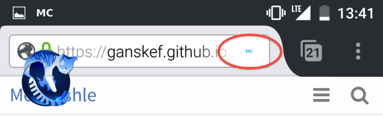

> Mostly relevant for Android usability.

# Page Actions Hassle

New binary previews are uploaded to fix very small *PageActions* icon on high 
resolution *Android* devices, and problems with enabling *Mo Cuishle* with it. 
It's possible now, to install on, and use with the *GNU IceCat* 
[browser](https://www.gnu.org/software/gnuzilla/).
<!--more-->

## Problems with PageActions

The *Mo Cuishle* add-on uses a *PageActions* icon to enable and disable the 
proxy settings in the browser on *Android* like a breeze. Sadly the first 
version has introduced some problems. 

On a high resolution device like *Google Nexus 5* the icon was displayed very 
small. This is solved now. It should be regular at every device.

If the tab with the *Mo Cuishle* navigation was not open, a disabled and grayed 
*PageActions* icon would'nt be re-enabled to blue. The *Mo Cuishle* add-on has 
to be disabled and enabled to fix this state.

## GNU IceCat browser

The *GNUZilla* and *IceCat* project provides a *Mozilla* suite with all brands
removed. *GNU IceCat* is the *GNU* version of the *Firefox* browser with 
additionally privacy protection features.

On *Android* *Mo Cuishle* is searching this browser too now, to install the 
add-on. To work with its *Bootstrap* based navigation on *Android*, the 
*LibreJS* add-on should be disabled. Otherwise the responsive menu can't be 
used.

It's necessary to allow an additional preference with *Gnu IceCat* which is 
disabled by default at *Mozilla Firefox*. It is done by the *Mo Cuishle* add-on 
to work with the proxy:

 * prefs.set(&quot;security.ssl.require_safe_negotiation&quot;, false);

## Upstream

Some dependencies are updated to its current versions: 

* Netty [4.1.0.CR7](http://netty.io/news/2016/04/10/4-1-0-CR7.html)

* LittleProxy + LittleProxy-mitm 
[1.1.0-beta3-offline](https://github.com/ganskef/LittleProxy-parent)