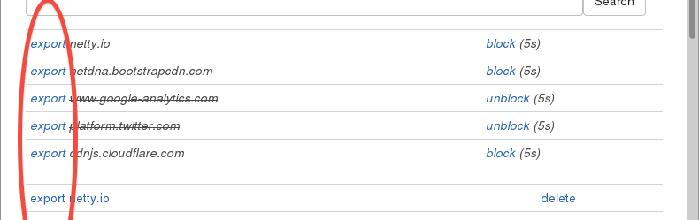
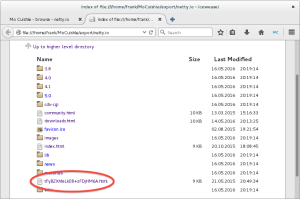

> Transparent view of the cached items.

# Export UI and cleaned Titles

New binary previews are uploaded to fulfill a major requirement of *Mo Cuishle*:
Transparency - everybody should be able to see what happens while using the 
Internet. All the contents can inspected in the file system with a text editor 
or an image viewer for example.
<!--more-->

## Export Cached Contents

The histories of addresses with viewed pages and the recent requested addresses
contains an *export* link now. All contents of this address is exported to a 
directory `~/MoCuishle/export` and showed in a browser tab. Exported directories 
will be purged every time. The export is **not** like *wget*, the contents are 
unmodified and often URLs can't be renamed to a file system item. It's a binary 
snapshot of the cache nor a working web copy. 

URLs which could not be renamed are often directory requests answered by the 
server with an index.html (figure) or dynamic generated contents with long 
query parts. Such items are named with the *MD5* hashed URL and a file system 
extension depending the *content-type*. *Mo Cuishle* uses this names internally 
prefixed with "U" for *URL*, "D" for data and "O" for outgoing.

**Please note:** Since sites are switching to *HTTPS* more and more, *HTTPS* is 
preferred before *HTTP* at the same location. On special interest it's possible 
to export the contents exclusively by inserting `http/` or `https/` like 
`http://localhost:9090/export/http/www.freebsd.org` for example. By extending 
the path the exported URLs can be restricted as starts with. 

## Cleaned Page Titles

Page titles listed in the history and search navigation are truncated with ... 
inserted. In case of HTML entities it could be garbage showed in the text. This 
should never happens now.

## Another Windows Issue

Opens tab in browser to reload outgoing URLs was failing (simply does nothing)
in Windows. This was a *CR+LF* instead of *LF* in a *RegExp* issue. It's fixed 
now.

## Outgoing with Links

In *outgoing* a history of URLs is provided with pages answered from cache to 
reload it later when a full Internet connection is available. It's easy to do 
and useful to provide links to the pages here. 

By the way, it's possible to make such changes yourself by copying template 
files from the `MoCuishle/markup` directory to `MoCuishle/markup/custom`. It's 
not a template engine, but mostly `String#format()`. Please drop me a line, if 
a modification could be in general interest.