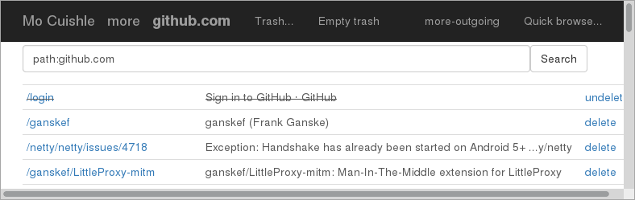

# Mo Cuishle - A caching proxy for offline use

> All web pages you've seen on the Internet via HTTP or HTTPS will be available later to read them without having to remain connected.

*Mo Cuishle* provides your [browse history](2016-01-22-browse-history.md) ordered by the last access, and an [outgoing history](2016-01-21-outgoing-history.md) of the pages you've requested offline to reload if needed. Also a [full text search](2016-01-20-full-text-search.md) over the cached web sites is included. The hosts requested in the last minute are listed and you can decide to [block or unblock](2016-01-19-block-unblock.md) or pass your requests on the fly. You can [export](2016-05-16-export-ui-and-cleaned-titles.md) all the cached content of an address in a Zip archive. It's been used on *Linux*, *FreeBSD*, *macOS* and *Windows*. Every platform with a browser and *Java* should work.

See **https://github.com/ganskef/MoCuishle** to build and install.

[include](navigation.md)

[include](README.md)

